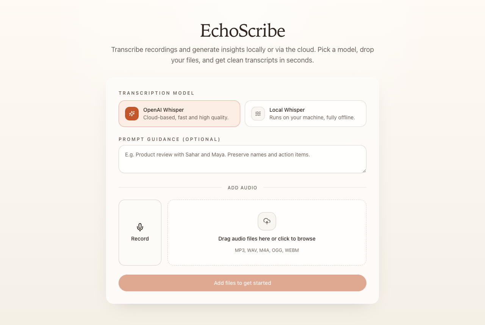

<div align="center">

<h1>
  
  EchoScribe
</h1>

Your audio transcription workspace - record or upload audio and get clean transcripts using OpenAI Whisper (cloud) or a local Whisper model running entirely on your machine.

**No accounts. No data leaves your machine when using local mode.**

### [Try it online → saharmor.me/EchoScribe](https://saharmor.me/EchoScribe/)

> The hosted version runs entirely in your browser — just bring your OpenAI API key. Your key stays in localStorage and is sent directly to OpenAI, never to any third-party server. Local Whisper is only available when you run the project locally with the Python backend.

<p>
<a href="https://saharmor.me/EchoScribe/" target="_blank"></a>
<a href="https://www.linkedin.com/in/sahar-mor/" target="_blank"></a>
<a href="https://x.com/theaievangelist" target="_blank"></a>
<a href="http://aitidbits.ai/" target="_blank"></a>
</p>

<br/>



</div>

## Features

- **Dual transcription engines** -- switch between OpenAI Whisper (fast, cloud-based) and local Whisper (offline, private) with a single click.
- **Live recording** -- capture audio directly from your microphone with Safari/Chrome/Firefox support.
- **Batch processing** -- drop multiple files at once and transcribe them sequentially.
- **Timestamped segments** -- local Whisper returns per-segment timing you can browse in a timeline view.
- **Prompt guidance** -- pass context (names, topics) to improve transcription accuracy.
- **Copy & review** -- view full transcripts in a modal, copy to clipboard with one click.

## Prerequisites

- **Python 3.10+**
- **Node.js 18+**
- **ffmpeg** on your `PATH` (required by pydub for audio conversion)
  ```bash
  # macOS
  brew install ffmpeg

  # Ubuntu / Debian
  sudo apt install ffmpeg
  ```
- An **OpenAI API key** if you want to use the cloud Whisper model.

## Quick start

```bash
# 1. Clone the repo
git clone https://github.com/saharmor/EchoScribe.git
cd EchoScribe

# 2. Configure the backend
cp backend/.env.example backend/.env
#    Edit backend/.env and add your OPENAI_API_KEY

# 3. Start everything (installs deps on first run)
chmod +x start_echo_scribe.sh
./start_echo_scribe.sh
```

The script will:
- Create a Python virtual environment in `backend/venv` and install pip dependencies (first run only).
- Install frontend npm packages (first run only).
- Start the FastAPI backend on **http://localhost:9090**.
- Start the Vite dev server on **http://localhost:8282**.


Available scripts:

| Command | Purpose |
|---------|---------|
| `npm run dev` | Start Vite dev server |
| `npm run build` | Production build |
| `npm run lint` | ESLint |
| `npm run typecheck` | TypeScript type checking |

